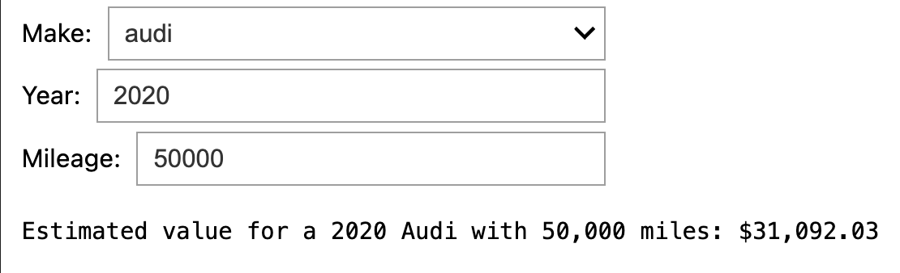

# Vehicle price prediction project
## About
This repo includes my capstone project submission for the WGU BSCS program.

It includes a Jupyter notebook with steps for analyzing, training a model, and estimating vehicle values based on their make, mileage, and age.

The model is trained on [this](https://www.kaggle.com/datasets/syedanwarafridi/vehicle-sales-data/data) dataset from Kaggle.

## Hosted instance
There's a hosted instance of the notebook available [here](https://colab.research.google.com/github/CarterSimonson/wgu-capstone/blob/main/app.ipynb) on Google Collab.

To run it, navigate to the link and:
- Sign in to your Google account (if you're not already)
- Click the "runtime" dropdown and select "run all" (or alternatively, use the `CTRL + F9` shortcut)
- Wait for each section to execute

After everything runs you will see a widget at the end of the notebook for interacting with the model!



## Local development
Activate the virtual env with:
```zsh
source venv/bin/activate
```

Install dependencies:
```zsh
./install.sh
```

Add a dependency:
```zsh
pip install your_package
./freeze.sh
```